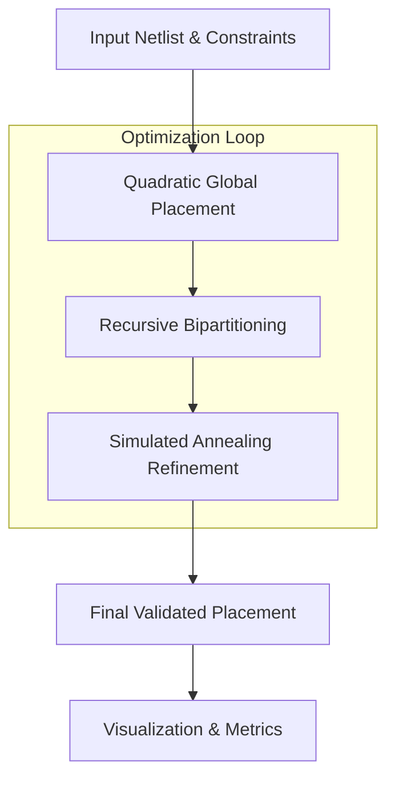

# AutoPlacer: Automated VLSI Placement Engine

<div align="center">


**A high-performance automated placement optimization engine for VLSI design.**

[Quick Start](#-quick-start) • [Features](#-key-features) • [Architecture](#-architecture) • [Usage](#-usage) • [Contributing](#-contributing)

</div>

---

## 🚀 Why AutoPlacer?

AutoPlacer solves the complex problem of **VLSI Cell Placement** by providing an end-to-end optimization flow. It bridges the gap between raw netlists and legal, congestion-aware layouts using industry-standard algorithms.

- **Wirelength Optimization**: Minimizes total wirelength to reduce parasitic delay and power.
- **Congestion Awareness**: Prevent routing hotspots before they occur in the routing phase.
- **Constraints-Driven**: Automatically respects chip boundaries and pre-placed blockages.

---

## ✨ Key Features

- 🏗️ **Quadratic Global Placement**: Fast, analytical initial cell positioning.
- 🧩 **Recursive Bisection**: Robust legalization considering blockages and density constraints.
- 🔥 **Simulated Annealing**: Fine-grained local refinement for superior solution quality.
- 📊 **Rich Visualization**: Real-time layout and congestion heatmap generation.
- ⚙️ **Multi-Objective Cost**: Balanced optimization of wirelength, density, and blockage penalties.

<table>
  <tr>
    <td align="center"><b>Final Placement</b></td>
    <td align="center"><b>Congestion Map</b></td>
  </tr>
  <tr>
    <td></td>
    <td></td>
  </tr>
</table>

---

## 🏗 Architecture

The placement flow follows a standard hierarchical approach to ensure scalability and quality:



---

## 🏁 Quick Start: How to Run

Follow these steps to get AutoPlacer running on your machine.

### 1. Installation
Install the package in editable mode to register the `autoplacer` command:
```bash
git clone https://github.com/ridash2005/AutoPlacer.git
cd AutoPlacer
pip install -e .
```

### 2. Launch the Engine
You can run AutoPlacer in three ways. If the `autoplacer` command is not recognized (due to PATH settings), use `python src/main.py` instead.

#### A. Interactive Configuration (Recommended)
Simply run the command with no arguments. AutoPlacer will guide you through:
1. **File Selection**: Pick your `.v`, `.sv`, or `.json` design.
2. **Advanced Config GUI**: A professional window to define:
   - **Chip Dimensions**: Custom board width and height.
   - **Obstacle Manager**: Add/Remove custom blockages by coordinates.
   - **Algorithm Tuning**: Adjust SA iterations and Bisection depth with built-in recommendations.
```bash
autoplacer
# OR
python src/main.py
```

#### B. Direct CLI (For Automation)
Specify your input file directly in the terminal:
```bash
autoplacer --input examples/simple_counter.v
# OR
python src/main.py --input examples/simple_counter.v
```

#### C. Built-in Industry Examples
Run pre-configured complex architectures:
```bash
autoplacer --example soc
# OR
python src/main.py --example soc
```

### 3. View Results
Every run generates a **`results/`** folder containing your `.def` coordinates, a `.json` summary, and high-quality layout/congestion PNG images.

---

## 🏗️ Industry Showcase

| Architecture | Command | Description |
|--------------|---------|-------------|
| **AI Accelerator** | `autoplacer --example systolic` | 10x10 Systolic Array mesh grid |
| **Modern SoC** | `autoplacer --example soc` | Multi-core SoC with peripheral hub |
| **Custom Design** | `autoplacer` (select file) | GUI pop-up to upload `.v`, `.sv`, or `.json` |

## 🛠️ End-to-End Production Flow

AutoPlacer acts as a standalone EDA tool for placement legalization and optimization.

1. **Input**: Supports structural **Verilog (.v)**, **SystemVerilog (.sv)**, and **JSON**.
2. **Execution**: Just run `autoplacer` to open the file selection dialog.
3. **Output**: Automatically generates a `results/` folder containing:
   - `design.def`: Industry-standard Design Exchange Format.
   - `design_placement.json`: Dictionary of cell coordinates.
   - `placement.png`: High-resolution layout visualization.
   - `congestion.png`: Routing hotspot heatmap.

---

## 🛠 Command Line Options

| Argument | Description | Default |
|----------|-------------|---------|
| `--iters` | Simulated annealing iterations | 10000 |
| `--partitions` | Recursive bisection levels | 4 |
| `--seed` | Random seed for reproducibility | 42 |
| `--no-vis` | Disable visual plots | False |

---

## 📂 Project Structure

- `src/`: Core package source code.
  - `algorithms/`: Placement and optimization logic.
  - `utils/`: Data parsing and visualization helpers.
  - `engine.py`: The `PlacementEngine` class.
- `examples/`: Sample scripts demonstrating library usage.
  - `custom_placement.py`: Basic API usage.
  - `ai_accelerator_grid.py`: 10x10 Systolic Array mesh architecture.
  - `soc_peripheral_hub.py`: Multi-core SoC with central NoC and IO pads.
- `setup.py`: Package installation script.

---

## 🤝 Contributing

Contributions are welcome! Whether it's optimization algorithms, bug fixes, or documentation, please feel free to:
1. Fork the repository.
2. Create a feature branch.
3. Submit a Pull Request.

See [CONTRIBUTING.md](CONTRIBUTING.md) for details.

---

## 📄 License

This project is licensed under the MIT License - see the [LICENSE](LICENSE) file for details.

---

<div align="center">
Developed by <b>Rick Arya Das</b> (rickaryadas@gmail.com)
</div>
