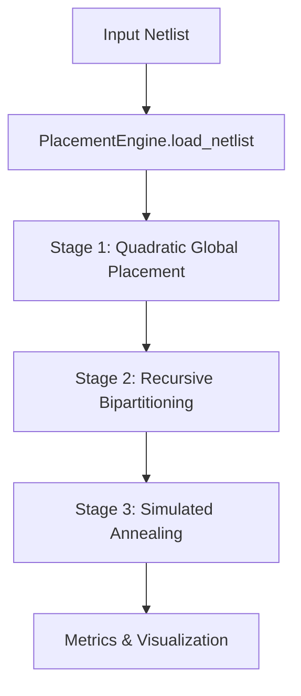

# AutoPlacer: Technical Architecture

AutoPlacer is a modular optimization suite for VLSI placement. This document serves as a hub for the core technical documentation.

## 🧱 Package Structure

The project is organized to separate high-level orchestration from low-level algorithms.

- [**API Reference**](API_REFERENCE.md): Documentation for classes and methods.
- [**Algorithms Guide**](ALGORITHMS.md): Theory behind QGP, Bipartitioning, and Annealing.
- [**Data Format Spec**](DATAFORMAT.md): Details on netlists and constraints.

---

## 🔄 The Placement Flow

AutoPlacer employs a hierarchical optimization strategy:

### 1. analytical Global Placement (QGP)
Formulates the problem as a system of linear equations to minimize squared wirelength.
- See: [ALGORITHMS.md#1-quadratic-global-placement](ALGORITHMS.md#1-quadratic-global-placement)

### 2. Recursive Bipartitioning (RB)
Legalizes the placement by balancing cell area across recursive chip splits.
- See: [ALGORITHMS.md#2-recursive-bipartitioning](ALGORITHMS.md#2-recursive-bipartitioning)

### 3. Simulated Annealing (SA) Refinement
Fine-grained local moves to reduce HPWL and congestion.
- See: [ALGORITHMS.md#3-simulated-annealing](ALGORITHMS.md#3-simulated-annealing)

---

## 🛠 Integration
AutoPlacer is designed to be used either as a command-line tool or as a library for broader EDA workflows. See the [**Quick Start**](../README.md#-quick-start) in the root README for installation and usage examples.
